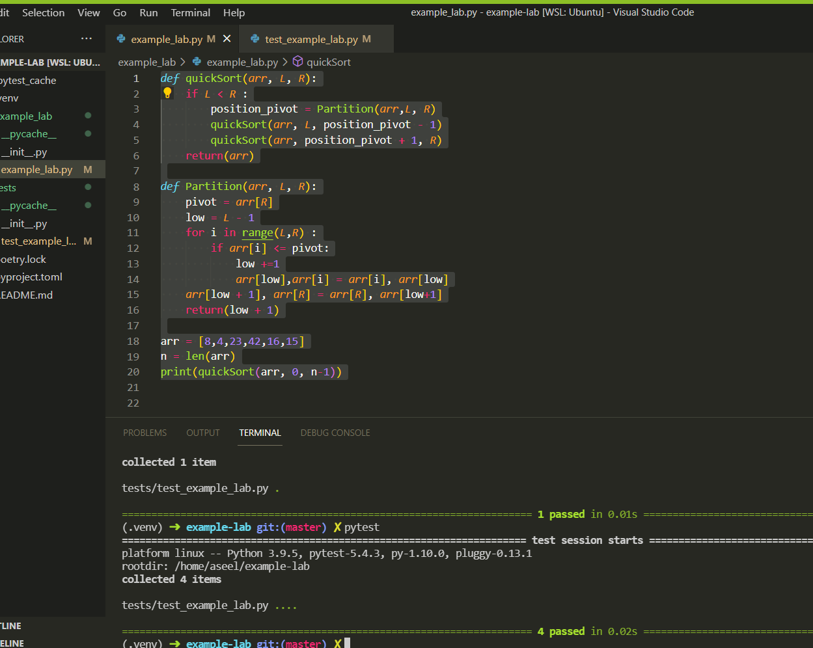

# Challenge Summary

_Review the pseudocode below, then trace the algorithm by stepping through the process with the provided sample array_

_also too ad the code based on the pseudo code and to add the tests for it_

## Whiteboard Process

## Approach & Efficiency

we used the recursion approach and the
Big O

time : O(nlogn)

space : O(1)

## Solution

_tests for quick sort_

I worked with Aseel Al Saqer
