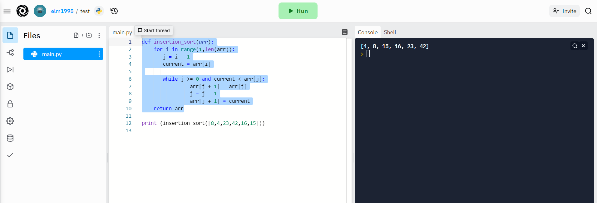

# Challenge Summary

to trace the psuedo code for the insertion sort method and understand the process of sorting the elements using the function also to implement the function using the psuedo code

## Whiteboard Process

## Approach & Efficiency

_I used the looping through the list approach_

Big O

time : O(n^2)

space: O(1)

## Solution

